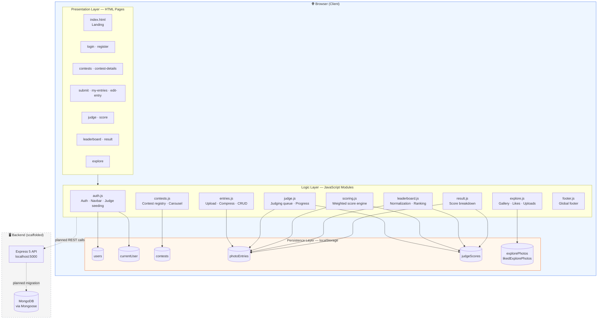
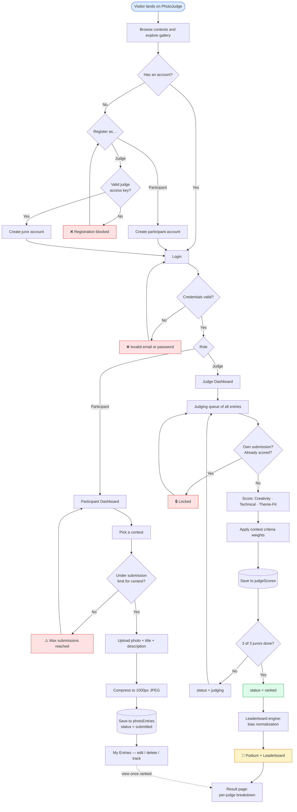
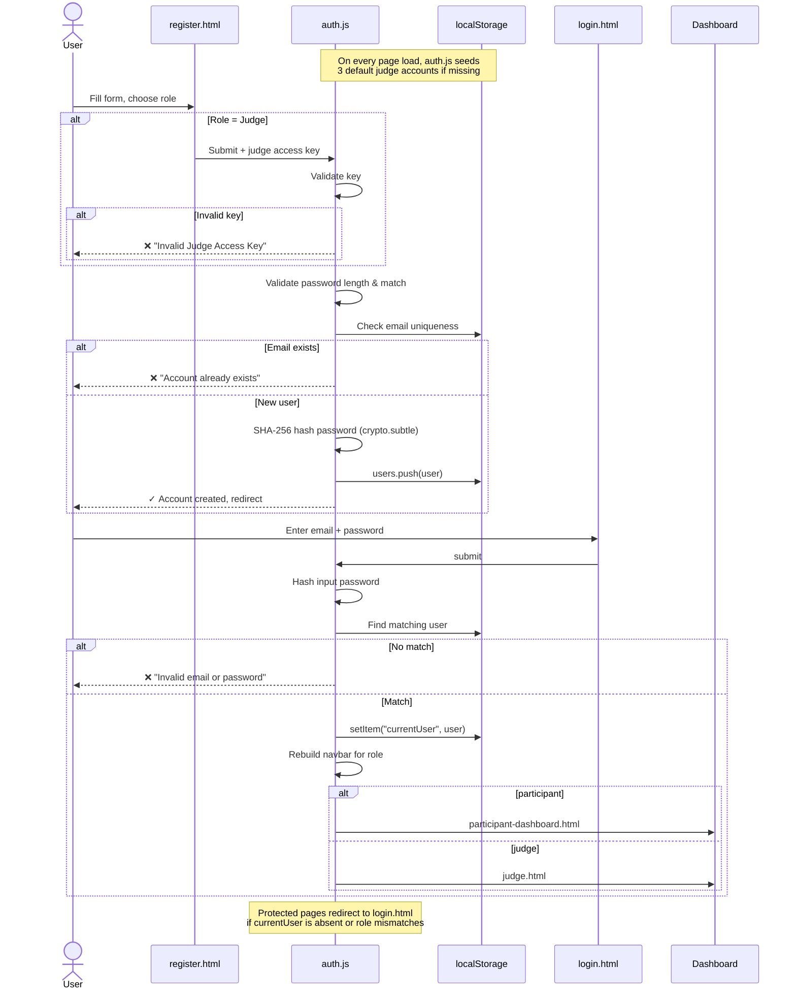
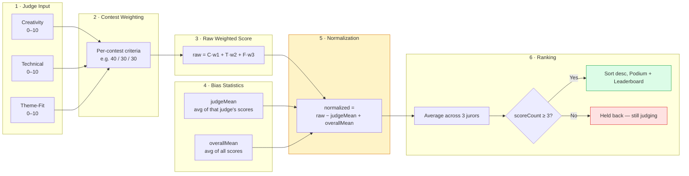
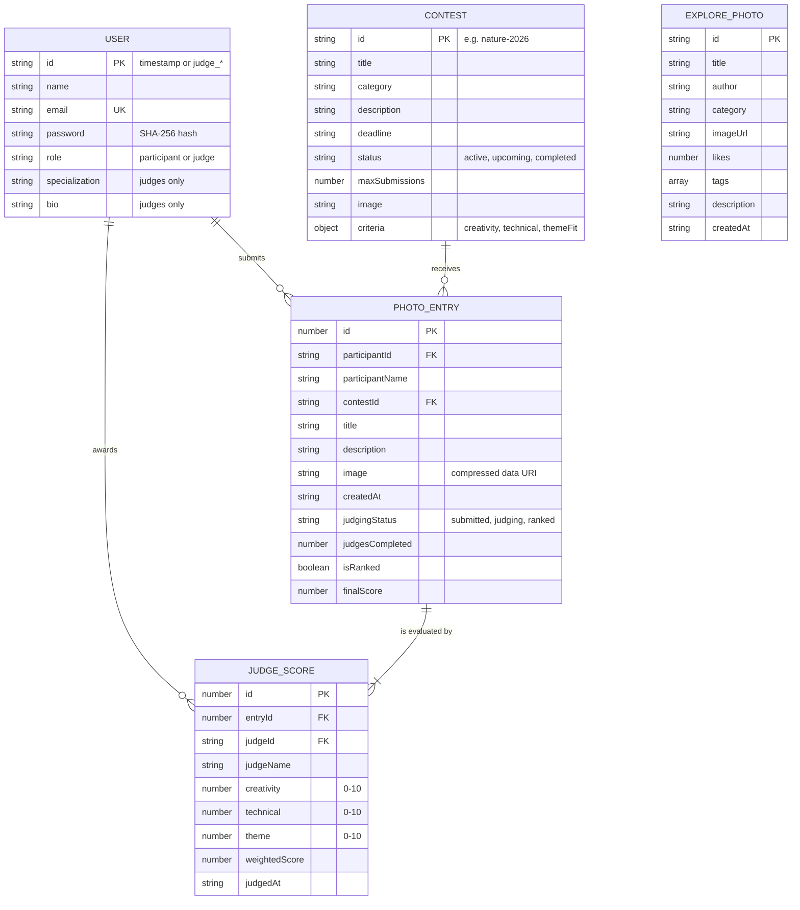

<div align="center">

# 📸 PhotoJudge

**A fair and transparent photo contest platform with weighted, bias-normalized judging.**

*Let every photo tell its story.*


</div>

---

## 📖 Overview

**PhotoJudge** is a photo-contest management and judging platform. Participants enter themed
contests, upload their photographs, and track their submissions. A panel of official jurors
scores every entry across three criteria, and the leaderboard engine converts those raw scores
into a ranking that is **statistically corrected for judge bias**.

The problem it solves: in most contests, a strict judge and a generous judge score the same photo
very differently, so a photo's rank depends partly on *who* happened to review it. PhotoJudge
applies **per-contest criteria weighting** plus **mean-centered normalization** so that a judge's
personal strictness is cancelled out before ranking.

> The application currently runs as a **fully functional client-side prototype**. All data
> (users, contests, entries, scores, likes) persists in the browser's `localStorage`. The
> Express/MongoDB backend is scaffolded and being migrated to — see [Roadmap](#-roadmap).

---

## ✨ Features

### For Participants
- 🔐 **Role-based registration & login** — participant or judge, with SHA-256 password hashing
- 🏆 **8 themed contests** — Nature, Wildlife, Travel, Urban, Portraits, Night & Light, Minimalism, Seasons
- 📤 **Photo submission** with automatic client-side compression (max 1000×1000, JPEG q0.70)
- 🚦 **Submission caps** — enforced per participant, per contest (default 3)
- 🗂️ **My Entries** — edit, delete, and track live judging status (`submitted → judging → ranked`)
- 📊 **Result page** — full per-judge score breakdown once an entry is fully judged
- 🖼️ **Explore gallery** — Pinterest-style masonry feed with search, category filters, sorting,
  likes, downloads, lightbox, and community uploads

### For Judges
- 🔑 **Gated judge registration** — requires an access key, so anyone can't self-appoint as juror
- 🎛️ **Score console** — three 0–10 sliders (Creativity, Technical, Theme-Fit) with a live
  weighted-score preview
- 🛡️ **Integrity guards** — no self-judging, no duplicate scoring of the same entry
- 📋 **Judge dashboard** — per-entry progress showing which of the 3 jurors have already scored

### For Everyone
- 🥇 **Podium + full leaderboard** — bias-normalized ranking, only for entries with all 3 scores
- 🌓 Responsive, modern UI with a dynamic role-aware navbar and global footer

---

## 🛠️ Tech Stack

| Layer | Technology |
|-------|-----------|
| **Markup / Styling** | HTML5, CSS3 (custom properties, Flexbox, Grid, masonry) |
| **Application logic** | Vanilla JavaScript (ES6+), no framework, no build step |
| **Client storage** | Web Storage API (`localStorage`) |
| **Crypto** | Web Crypto API (`crypto.subtle` → SHA-256) |
| **Image processing** | `FileReader` + `<canvas>` compression → data URI |
| **Backend (scaffold)** | Node.js, Express 5 |
| **Planned backend deps** | Mongoose 9, JWT, bcryptjs, Multer, Helmet, CORS, express-validator, dotenv |
| **Dev tooling** | nodemon |

---

## 🏗️ System Architecture



---

## 🔄 End-to-End Contest Workflow



---

## 🔐 Authentication & Role Routing



---

## 🧮 The Scoring & Normalization Pipeline

This is the heart of PhotoJudge — how three subjective juror opinions become one fair rank.



### Why normalize?

Each contest defines its own criteria weights, so a raw weighted score is:

```
raw = (creativity × wCreativity) + (technical × wTechnical) + (themeFit × wThemeFit)
```

But raw scores still carry each juror's personal calibration. Mean-centering removes it:

```
normalized = raw − judgeMean + overallMean
```

| | Judge A (generous) | Judge B (strict) |
|---|---|---|
| Personal average | 8.5 | 6.5 |
| Overall average | 7.5 | 7.5 |
| Raw score given to a photo | 8.5 | 6.5 |
| **Normalized score** | **7.5** | **7.5** |

Both jurors thought the photo was *exactly average for them* — after normalization they agree,
and rank no longer depends on which juror a photo happened to draw.

**Ranking gate:** an entry only enters the leaderboard once **all 3 jurors** have scored it, so
partially-judged photos can never out-rank fully-judged ones.

---

## 🗃️ Data Model



### localStorage keys

| Key | Contents |
|-----|----------|
| `users` | All registered accounts (participants + seeded/registered judges) |
| `currentUser` | The active session's user object |
| `contests` | Contest registry, seeded on first load and merged on upgrade |
| `photoEntries` | Every submitted photograph with its judging state |
| `judgeScores` | One record per (judge × entry) evaluation |
| `explorePhotos` | Community gallery feed |
| `likedExplorePhotos` | IDs this browser has liked |

---

## 📁 Project Structure

```
phot-contes/
├── Frontend/
│   ├── index.html                    # Landing page — hero, themes carousel, how-it-works
│   ├── css/
│   │   ├── style.css                 # Global tokens, navbar, footer, shared components
│   │   ├── home.css                  # Landing page
│   │   ├── auth.css                  # Login & register
│   │   ├── contests.css              # Contest grid & details
│   │   ├── submit.css                # Submission form & upload preview
│   │   ├── my-entries.css            # Entry cards & status chips
│   │   ├── dashboard.css             # Participant dashboard
│   │   ├── judge.css                 # Judge dashboard & queue
│   │   ├── score.css                 # Score console & sliders
│   │   ├── leaderboard.css           # Podium & ranking table
│   │   ├── result.css                # Per-judge breakdown
│   │   └── explore.css               # Masonry gallery & lightbox
│   ├── js/
│   │   ├── auth.js                   # Register, login, role-aware navbar, judge seeding
│   │   ├── contests.js               # Contest data, seeding, listing, details, carousel
│   │   ├── entries.js                # Upload, compression, entry CRUD, status sync
│   │   ├── judge.js                  # Judging queue, per-entry juror progress
│   │   ├── scoring.js                # Weighted score engine, integrity guards
│   │   ├── leaderboard.js            # Bias normalization, podium & ranking
│   │   ├── result.js                 # Individual result breakdown
│   │   ├── explore.js                # Gallery, search, filters, likes, uploads
│   │   ├── footer.js                 # Injected global footer
│   │   └── script.js                 # Landing page CTA
│   └── pages/
│       ├── login.html                register.html
│       ├── contests.html             contest-details.html
│       ├── participant-dashboard.html
│       ├── submit.html               my-entries.html        edit-entry.html
│       ├── judge.html                score.html
│       ├── leaderboard.html          result.html
│       └── explore.html
├── backend/
│   ├── server.js                     # Express 5 entry point (health route)
│   └── package.json                  # API dependencies
├── .gitignore
└── README.md
```

### Page → module map

| Page | Modules loaded |
|------|----------------|
| `index.html` | `script.js`, `auth.js`, `footer.js` |
| `login.html` · `register.html` | `auth.js`, `footer.js` |
| `contests.html` · `contest-details.html` | `auth.js`, `contests.js`, `footer.js` |
| `submit.html` · `my-entries.html` · `edit-entry.html` | `auth.js`, `entries.js`, `footer.js` |
| `judge.html` | `auth.js`, `judge.js`, `footer.js` |
| `score.html` | `auth.js`, `scoring.js`, `footer.js` |
| `leaderboard.html` | `auth.js`, `leaderboard.js`, `footer.js` |
| `result.html` | `auth.js`, `result.js`, `footer.js` |
| `explore.html` | `auth.js`, `explore.js`, `footer.js` |
| `participant-dashboard.html` | `auth.js`, `footer.js` |

---

## 🚀 Getting Started

### Prerequisites
- A modern browser (Chrome, Edge, Firefox, Safari)
- [Node.js](https://nodejs.org/) 18+ — only needed for the backend scaffold

### 1. Clone

```bash
git clone https://github.com/komalpreetkaur3048/photo-contest-judging.git
cd photo-contest-judging
```

### 2. Run the frontend

The frontend has **no build step**. Serve the `Frontend/` folder over HTTP:

```bash
# Option A — VS Code
# Right-click Frontend/index.html, then "Open with Live Server"

# Option B — Python
cd Frontend && python -m http.server 5500

# Option C — Node
npx serve Frontend
```

Then open <http://localhost:5500>.

> ⚠️ Serve over `http://` rather than opening the file directly — the Web Crypto API used for
> password hashing requires a secure context (`http://localhost` counts as one).

### 3. Run the backend (optional)

```bash
cd backend
npm install
npx nodemon server.js     # or: node server.js
```

The API responds at <http://localhost:5000> with a health message.

---

## 🔑 Demo Accounts

Three juror accounts are seeded automatically on first page load:

| Email | Password | Role |
|-------|----------|------|
| `judge1@photojudge.com` | `judge123` | Senior Wildlife & Landscape Juror |
| `judge2@photojudge.com` | `judge123` | Visual Storytelling & Composition Critic |
| `judge3@photojudge.com` | `judge123` | Fine Art Photography Juror |

Register your own participant account from the **Register** page — no key required.
Registering a **new judge** requires the demo access key **`JUDGE2026`**.

> 🔒 The access key and the seeded credentials live in client-side code because this is a
> prototype. They move server-side with the backend migration.

### Try the full loop

1. Register a participant, then submit a photo to **Nature Through My Lens**
2. Sign out, log in as `judge1`, and score the entry
3. Repeat with `judge2` and `judge3`
4. Open **Leaderboard** — the entry is now ranked with its normalized score
5. Open **My Entries → View Result** for the per-judge breakdown

To reset all demo data, clear the site's `localStorage` in DevTools (Application → Storage).

---

## 🧭 Design Decisions

- **No framework, no build step.** Every page is plain HTML that loads plain ES6 scripts,
  so the project runs from any static host with zero tooling.
- **Seed-and-merge for contests.** `initializeContests()` seeds defaults on first run, then on
  later runs merges new default fields into saved records — so schema additions don't wipe
  a user's existing data.
- **Two independent status writers.** `syncEntryJudgingStates()` (entries.js) and the leaderboard
  engine both recompute an entry's judging status from `judgeScores`, so the derived status stays
  correct no matter which page the user opens first.
- **Compression before storage.** `localStorage` holds roughly 5 MB; photos are downscaled to
  1000 px and re-encoded as JPEG q0.70 before being stored as data URIs.
- **Integrity over convenience.** Self-judging and duplicate scoring are blocked at write time,
  not just hidden in the UI.

---

## 🗺️ Roadmap

- [x] Role-based auth with hashed passwords
- [x] Contest registry with per-contest criteria weights
- [x] Photo submission with compression and per-contest caps
- [x] Judge dashboard with integrity guards
- [x] Weighted scoring engine
- [x] Bias-normalized leaderboard with podium
- [x] Community Explore gallery
- [ ] **Express REST API** — users, contests, entries, scores
- [ ] **MongoDB persistence** via Mongoose models
- [ ] **JWT sessions** + bcrypt password hashing server-side
- [ ] **Multer** file uploads to disk/cloud storage instead of data URIs
- [ ] **express-validator** request validation and **Helmet** hardening
- [ ] Admin panel for creating and closing contests
- [ ] Email notifications on judging completion
- [ ] Automated contest deadline enforcement

---

## 🤝 Contributing

1. Fork the repository
2. Create a branch — `git checkout -b feature/your-feature`
3. Commit — `git commit -m "Add your feature"`
4. Push — `git push origin feature/your-feature`
5. Open a Pull Request

Please match the existing code style: descriptive section banners, `function` declarations over
arrow functions in page modules, and defensive `if (element)` DOM guards.

---

## 📄 License

Released under the **ISC License**.

---

<div align="center">

**PhotoJudge** — *Fair · Transparent · Smart*

</div>
